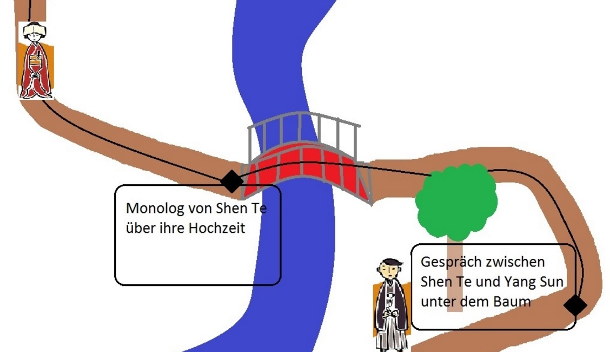

# Park in Sezuan

In diesem Projekt wird das Kapitel 3 “Abend im Stadtpark” behandelt. Der Benutzer bewegt sich aus der Ich-Perspektive von Shen Te durch den Park.
Während ihrem Spaziergang durch den Park nimmt die Geschichte ihren Lauf. Unterwegs bleibt Shen Te immer wieder an Schauplätzen stehen, an denen jeweils ein Teil des Kapitels erzählt wird. Bei solchen Ereignissen verlässt die Kamera die First-Person-Sicht und erlaubt es dem Benutzer z.B. das Gespräch zwischen Shen Te und Yang Sun als Beobachter wie im Theater zu betrachten. Der Weg durch die Szene ist hierbei vorgegeben, es wird eine festgelegte Einstellungsfolge geben. Der Benutzer hat also nicht die Möglichkeit, sich in der Geschichte hin und her zu bewegen.

Unterschiedliche Lichtverhältnisse, Regen, Musik und akustische Untermalung werden zusätzlich eingesetzt um die Narration zu unterstützen. Die Dialoge werden eingesprochen und an jedem Schauplatz jeweils abgespielt.

Die Darstellung der Charaktere wird in 2D stattfinden, ähnlich wie in einem Comic. Die Landschaft wird in 3D dargestellt.

Modelliert werden:

2D

Der Wasserverkäufer

Shen Te

Yang Sun

Ein Schwarm Kraniche

3D

Parkgelände mit Rasen, Weg, ggf. einem Pavillon und Pflanzen
Fluss
Brücke
Baum an dem sich Sun Yan umbringen will

Gegebenenfalls werden teilweise auch fertige 3D Objekte aus

Als Modellierungssoftware wird  3DS Max genutzt.
